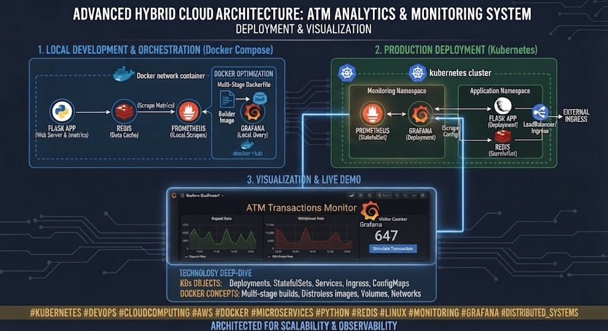

# FinTech ATM Analytics & Monitoring System

An advanced hybrid cloud architecture demonstrating container orchestration, local development with Docker Compose, and production deployment using Kubernetes.

#Architecture & Visualization

## Key Features
- **Local Development:** Docker Compose & Multi-stage builds.
- **Production:** Kubernetes Cluster.
- **Monitoring:** Prometheus & Grafana.
-
